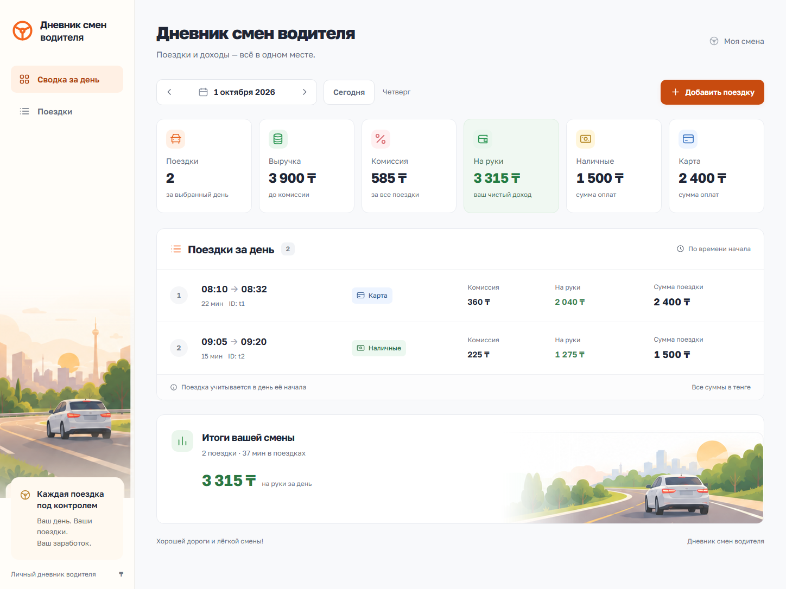

# Дневник смен водителя

Небольшой веб-сервис для одного водителя: учёт поездок по дням, финансовая сводка и добавление записей с защитой от дублей. Интерфейс на русском, суммы в тенге.

## Стек

Python 3.10+, FastAPI, SQLAlchemy 2, SQLite, Pydantic 2, Pytest. Интерфейс: HTML, CSS, JavaScript без сборки. Шрифт Golos Text хранится локально; лицензия SIL Open Font License в `static/fonts/OFL.txt`. Для работы интерфейса внешние ресурсы не требуются. Дорожная иллюстрация отображается из предоставленного пользователем изображения, ограниченного CSS-областью.

## Установка и запуск

Из корня проекта:

```powershell
python -m venv .venv
.\.venv\Scripts\python.exe -m pip install -r requirements.txt
.\.venv\Scripts\python.exe -m uvicorn app.main:app --reload --host 127.0.0.1 --port 8000
```

Открыть http://127.0.0.1:8000. Linux/macOS: использовать `.venv/bin/python` вместо `.\.venv\Scripts\python.exe`.

При запуске создаётся `driver.db`. Записи из `data/trips.json` импортируются по уникальному ID; перезапуск не создаёт дубли. Начальная дата интерфейса — 1 октября 2026 года, чтобы показать записи из ТЗ. Кнопка «Сегодня» выбирает текущую дату в `Asia/Qyzylorda`, независимо от часового пояса компьютера. Другая начальная дата: `/?date=2026-10-06`.

`DATABASE_URL` позволяет указать другой файл SQLite, например `sqlite:///D:/data/driver.db`. Родительская папка должна существовать. База не включается в Git; для резервной копии остановите приложение и скопируйте файл.

## Развёртывание на Vercel без PostgreSQL

Vercel обнаруживает FastAPI через корневой `index.py`. Версия Python для хостинга закреплена в `.python-version`. Локально приложение использует постоянный `driver.db`; на Vercel (`VERCEL=1`) автоматически выбирается SQLite в доступной для записи временной папке `/tmp`. Дополнительные сервисы и переменные окружения для демо не нужны.

1. Открыть https://vercel.com/new и импортировать `SsToRR/arqa`.
2. Выбрать FastAPI, Root Directory оставить корнем репозитория.
3. Build Command и Output Directory оставить со стандартными значениями без переопределения.
4. Если ранее добавлен `DATABASE_URL`, удалить его либо указать `sqlite:////tmp/driver.db`.
5. Нажать Deploy. Для уже созданного проекта развернуть последний коммит ветки `main`.

Это **демо с временным хранением**: записи в `/tmp` могут исчезнуть при замене экземпляра функции или развёртывании; разные экземпляры не делят одну базу. Уникальность ID гарантируется только внутри базы конкретного экземпляра. Для постоянного хранения SQLite требуется сервер с постоянным диском. Подробности: [файловая система Vercel](https://vercel.com/docs/functions/runtimes), [SQLite на Vercel](https://vercel.com/kb/guide/is-sqlite-supported-in-vercel).

## API

- `GET /api/trips?date=2026-10-01` — поездки, отсортированные по времени начала.
- `GET /api/summary?date=2026-10-01` — `date`, `trips`, `revenue`, `commission`, `net`, `cash`, `card`.
- `POST /api/trips` — добавление поездки; 201 для новой, 200 с существующей записью для повторного ID. Уже сохранённая запись не изменяется.
- `/docs` — интерактивная документация API.

Пример тела POST:

```json
{
  "id": "t3",
  "start": "2026-10-01T10:00:00+05:00",
  "end": "2026-10-01T10:30:00+05:00",
  "amount": 3000,
  "payment": "cash",
  "commission": 450
}
```

ID непустой, максимум 100 символов. Сумма положительная, комиссия неотрицательная, максимум два десятичных знака. Окончание строго позже начала. Способ оплаты только `cash` или `card`. Даты должны содержать часовой пояс. Неверные данные возвращают 422. Уникальность ID обеспечивает первичный ключ SQLite, включая конкурентную вставку. День определяется датой `start` с переданным смещением, а не UTC. Интерфейс вводит время Казахстана (UTC+5). Ночная поездка допускает окончание следующей датой.

Деньги хранятся и суммируются как Decimal/Numeric с точностью до двух знаков. Комиссия задаётся в тенге вручную; процентный расчёт не применяется. Если комиссия превышает сумму поездки, чистый доход отрицательный — ТЗ этого не запрещает.

## Тесты

```powershell
python -m pytest -q
```

Изолированные временные базы. Проверяются обязательные расчёты 3900/585/3315 и защита от дублей, неверные поля, ночные поездки, часовые пояса, сортировка, пустой день, дробные суммы, сохранение после перезапуска и повторный импорт JSON.

## Реализованные требования

Выбор дня стрелками и календарём, переход на сегодня, шесть показателей, список поездок с ID и длительностью, форма добавления в боковой панели, предварительная сумма на руки, серверная и клиентская валидация, идемпотентность по ID, SQLite, исходный JSON, API и тесты. Интерфейс поддерживает узкие экраны, клавиатуру, видимый фокус, сообщения об ошибках и пустое состояние.

Авторизация, несколько водителей, редактирование, удаление, карты, GPS, расстояния, платёжные системы и сложная аналитика не входят в проект. Исходный код: [GitHub — SsToRR/arqa](https://github.com/SsToRR/arqa).

## Использование ИИ

Codex использован для разработки интерфейса, FastAPI-приложения, моделей, валидации, тестов и документации. При сверке референса с ТЗ обнаружены различия: на изображении отсутствует ID и показана процентная комиссия. В реализации добавлен ID, комиссия заменена на абсолютную сумму. Проверки выполнены автоматически агентом; самостоятельные изменения пользователя не заявляются. Служебный модуль дизайн-навыка не запустился, поэтому дизайн реализован по ТЗ и скриншоту без него.

## Скриншоты



[Вид на мобильном экране](docs/screenshots/mobile.png)
